<div align="center">
  
  
  
  
  
</div>

<h3 align="center">Integração NodeJs com Mercado Pago</h3>
<p align="center">
Integração simples do nodejs com o mercado pago.
  <br>
</p>

<h3>Informações gerais</h3>


### Introdução
O objetivo deste projeto é a integração da API de pagamentos do mercado pago com o Nodejs. Este projeto foi feito usando a API Sandbox do mercado pago e você poderá fazer toda a integração e testes sem custar nenhum centavo.
Você precisará ter obviamente uma conta verificado no mercado pago, o processo todo envolve além de dados pessoais, algumas fotos suas e de sua identidade. Acesse o endereço abaixo e siga todos os passos para ter acesso a API.
[Mercado pago para desenvolvedores](https://www.mercadopago.com.br/developers/)

### Configurando a aplicação
O objetivo destes passos é obtermos um token que nos dará acesso a API do mercado pago. Na parte superior da tela, vá em "Suas integrações" e crie uma aplicação

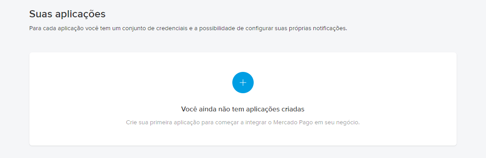

Escolha um nome para a aplicação e escolha a opção **Ainda não escolhi um produto**

Salve o token no arquivo **'.env'** do projeto


### Rodando a aplicação
Agora rode o comando 'npm install' para instalar os pacotes que a aplicação exige e excute o arquivo index.js com o comando
```shell
npm install
node index.js
```

### Tornando o localhost público.
Quando um pagamento é feito, o mercado pago precisa avisar a aplicação que o pagamento foi realizado, e como o mercado pago não tem acesso ao nosso computador, precisamos resolver esse problema. Você pode subir a aplicação em um servidor ou podemos disponibilizar o nosso localhost na internet.

Eu optei pela segunda opção, usando um software chamando ngrok.

Acesse o site do [ngrok](https://ngrok.com/) e crie uma conta free.

Faça o download do arquivo, ele é um arquivo compactado com um executável chamado **ngrok.exe**. Para simplificar, vou deixar esse arquivo na minha área de trabalho.

Agora acesse o dashboardo do ngrok e rode os comandos que ele sugere. **eu vou mostrar o processo no Windows**

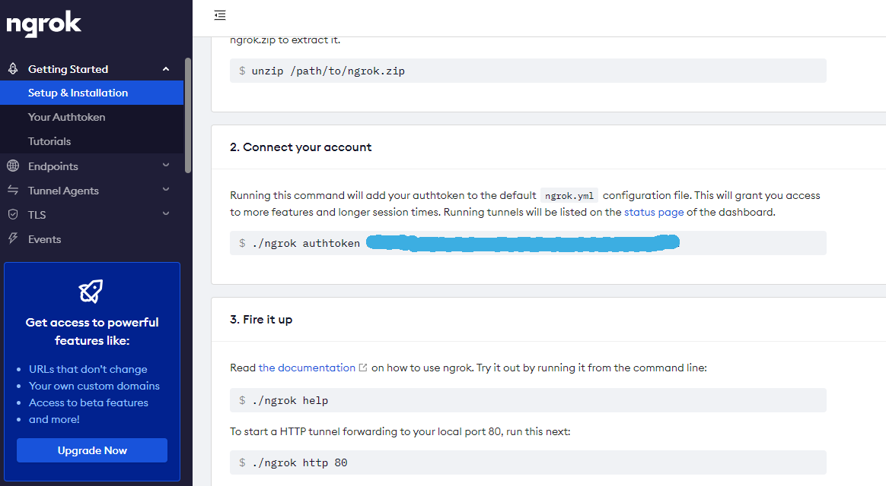

Como estou no Windows, fiz os comandos conforme o exemplo abaixo. Perceba que no Windows eu naveguei até a pasta **Desktop** e executei os comandos com a '\'(barra) invertida. Basicamente você informará o token do ngrok e a porta que o ngrok deve disponibilizar na internet. (A porta da que a aplicação está rodando)

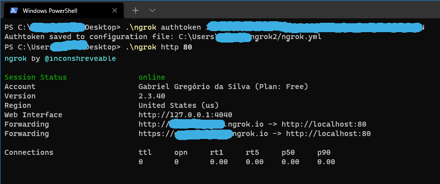

Agora o nosso localhost na porta 80 está disponível nos dois endereços mostrado no ngrok. Precisamos do endereço com HTTPS

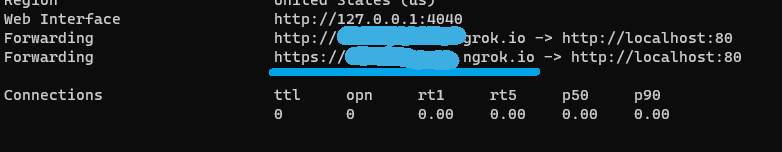

Em uma guia anônima ou outro navegador, acesse o endereço para confirmar que a aplicação **'está no ar'**.

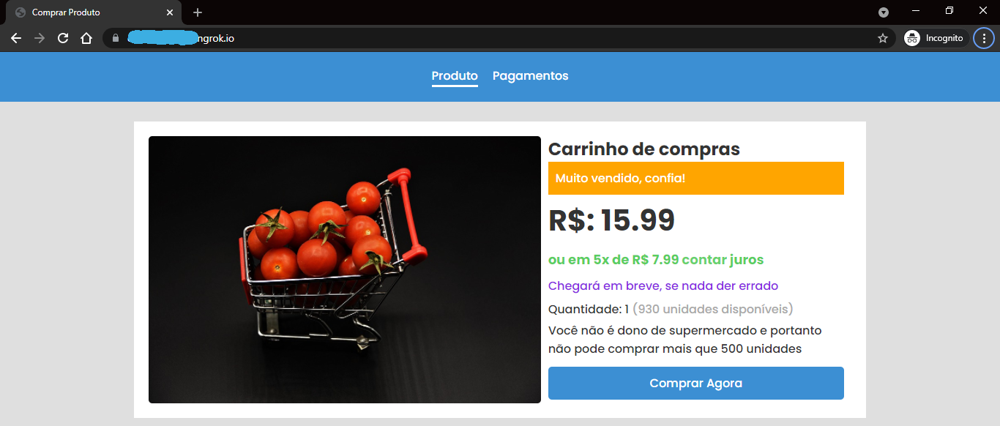


### Configurando o IPN
Agora precisamos configurar o IPN, que é basicamente a forma como o mercado pago avisa o servidor que uma compra foi paga. Acesse o [IPN do mercado pago](https://www.mercadopago.com.br/developers/panel/notifications/ipn)

Informe o endereço HTTPS do ngrok com o **'/notify'** no final. Esta será uma rota que o mercado pago usará para se comunicar com nossa aplicação.

Clique em **'Experimente'** para o mercadopago confirmar.

Marque as duas opções conforme mostrada na imagem abaixo e **salve as configurações.**
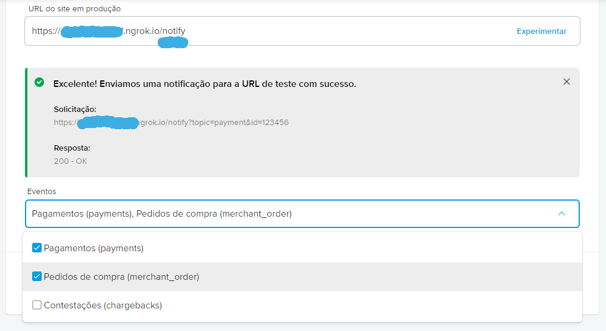

Agora a aplicação está pronta e configurada.

### Considerações antes do teste
Não entrarei em detalhes do código ok, mas, você precisa saber que estamos com o modo sandbox ativado, no código da aplicação.

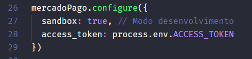

Esse modo tem o propósito de criarmos a aplicação em desenvolvimento, e o mercado pago oferece a possibilidade de usarmos um cartão de crédito de testes e um ambiente de homologação para testarmos a aplicação. Para você acessar os cartões de testes do mercado pago, você precisa acessar [este endereço](https://www.mercadopago.com.br/developers/pt/guides/online-payments/checkout-pro/test-integration).

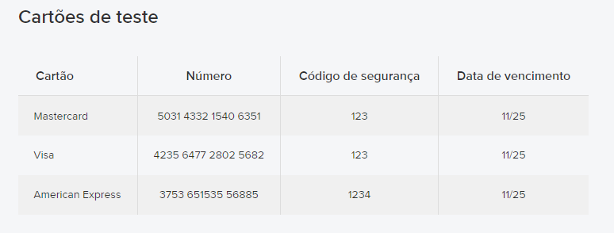

Como você também deve imaginar, precisamos de um CPF, mas não precisa ser o seu, você pode gerar um aleatório no site [4devs](https://www.4devs.com.br/gerador_de_cpf).

### Testando a aplicação
Agora sim, vamos testar a aplicação! Abra uma guia anônima do navegador, ou, outro navegador, já que você não pode pagar a si mesmo, e acesse o endereço disponibilizado pelo ngrok.


Clique em comprar agora. Você será redirecionado para a página de checkout do mercado pago. **Aceite os cokies**

Escolha a opção **"Novo Cartão."**

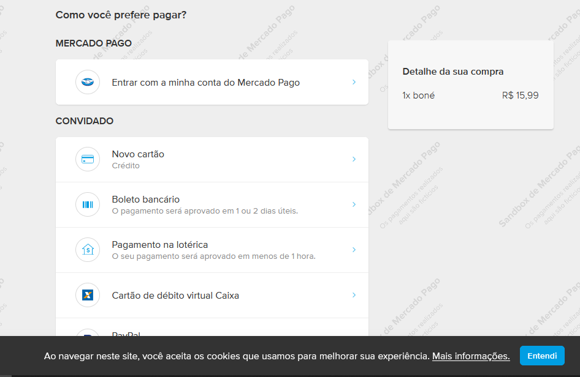


Use os cartões de testes que o próprio mercado pago disponibiliza. O nome do titular pode ser qualquer coisa textual.

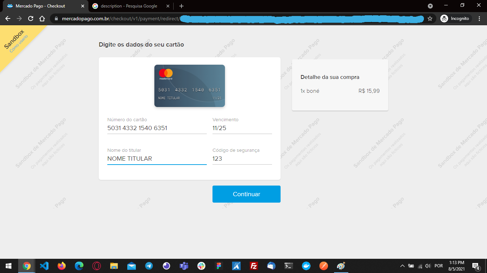

Informe um CPF válido, aquele que você gerou no site **'4devs'**.

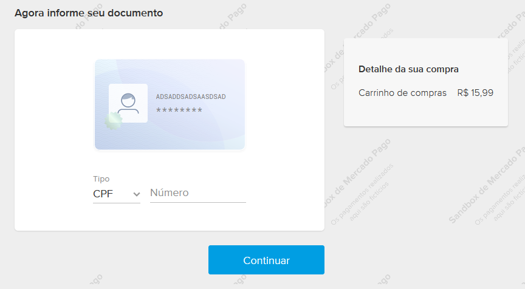

Confirme o pagamento

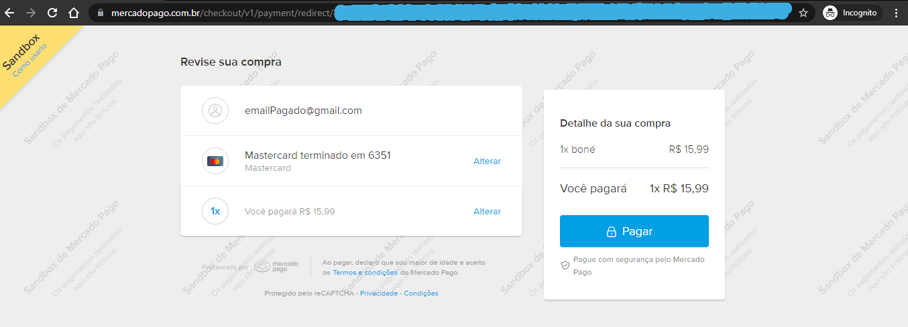

Você deverá receber uma mensagem de sucesso.
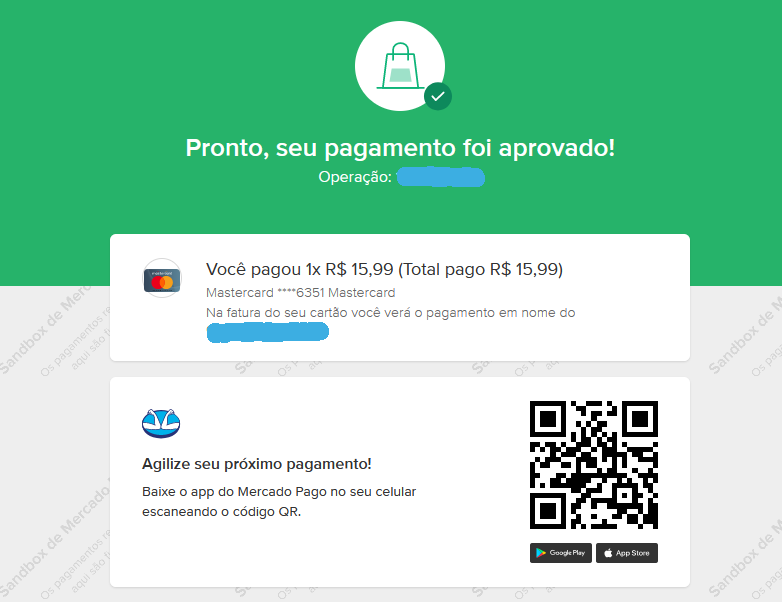

Acesse **imediatamente** a guia de pagamentos e em 20 a 30 segundos, atualize a tela. Ela verá indicar o que o pagamento foi feito

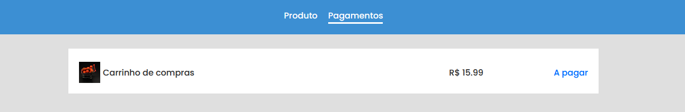

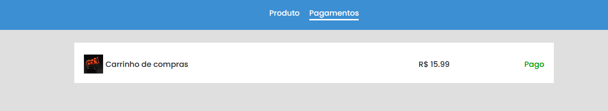

Esse tempo de 20 a 30 s foi definido na aplicação, já que pode demorar um pouco para o dado ser salvo no banco de dados do mercadopago.

Também vale ressaltar que em caso de instabilidade na rede ou sua aplicação sair fora do ar, o mercado pago tentará novamente enviar a mensagem para o seu servidor. Confira a documentação para saber dos detalhes.
